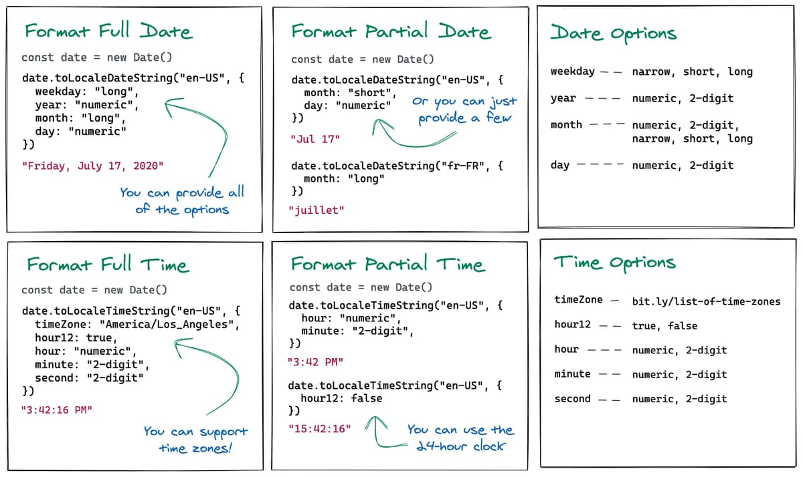
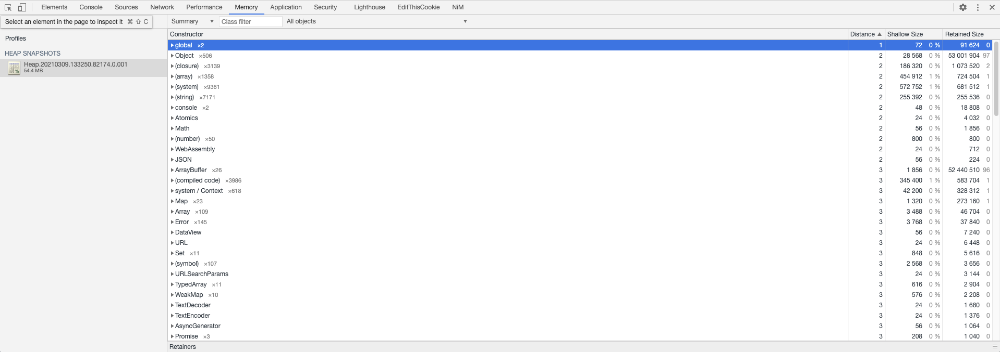
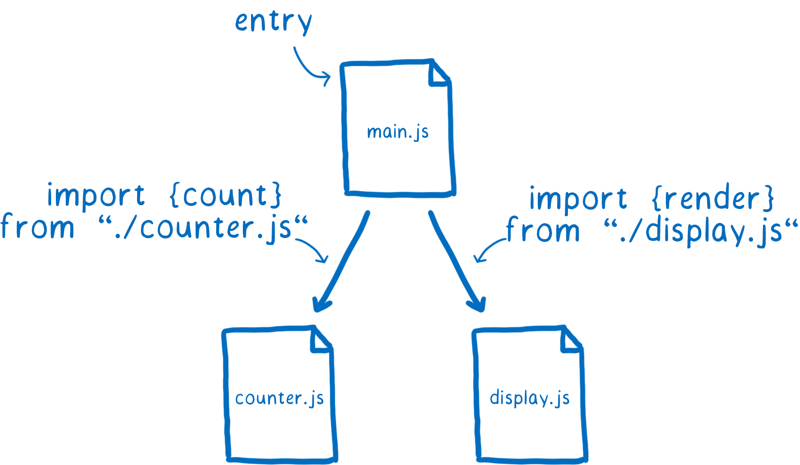

### **1、 [Chrome 新功能：支持录制、重放和测试用户操作！](https://mp.weixin.qq.com/s/MkaNfzYJMSFCiAABQuIjuA)**


Chrome 在最新的版本（Chrome 97）里面新增了一个非常好用的功能，可以帮助我们录制、回放、测试用户操作。

### **2、 [Webpack 性能系列四：分包优化](https://mp.weixin.qq.com/s/LrASIdA19iwIwng29G5HpA)**

详细讲述了 SplitChunksPlugin 的分包方案及其细节

### **3、 [node_modules 困境](https://juejin.cn/post/6914508615969669127)**

洋洋洒洒将近一万字，提出了 node_modules 的发展现状及其若干问题，每次读后都受益匪浅。

### **4、 [coa 和 依赖锁定](https://mp.weixin.qq.com/s?src=11&timestamp=1636378040&ver=3424&signature=yQmx-VEh991eTxqSOugoPwP5FQlqAe0zhiTyxYxxP9WSO8MjKW5-3lIgAv-tpu-5JJUWVboL7HtAMmPnWa49Zs8I6pnxajE1WwUB2kgHpMtRQL0bSrj8*splg7lVFYb0&new=1)**

### **5、 [现代 web 开发困局](https://juejin.cn/post/7025868886914400293)**

### **6、 [现代化 Web 关于 HTTP 缓存新的标准](https://httptoolkit.tech/blog/status-targeted-caching-headers/)**


现代化 Web 关于 HTTP 缓存新的标准，两个响应头

1. Cache-Status
2. [Target]-Cache-Control

可以更容易地配置源服务器到客户端中间各级中间代理服务器的缓存控制

### **7、 [Javascript 是如何在 v8 中执行的](https://juejin.cn/post/6844903990073753613)**


字节码是机器码的抽象。如果字节码的设计与物理 CPU 的计算模型相同，那么将字节码编译成机器代码就会更加容易。这就是为什么解释器通常是寄存器或堆栈机器。Ignition 是一个带有累加器的寄存器。

### **8、 [谈谈我这些年对前端框架的理解](https://mp.weixin.qq.com/s/mZ7KuFjyCWNCAq7HnXg96A)**

技术从出现到完善到连带的周边生态的完善是一个轮回，从最开始服务端渲染，到了后来的客户端渲染，然后出现了逻辑层的组件方案，最后又要基于组件方案重新实现服务端渲染。

其实物理层的东西一直都没变，只是逻辑层不断的一层添加又一层，目的都是为了提高生产效率，降低开发成本，保证质量，这也是技术发展的趋势。"

### **9、 [Natively Format JavaScript Dates and Times](https://elijahmanor.com/blog/format-js-dates-and-times)**


借助于 Date.prototype.toLocaleDateString() 可以做一些格式化的事情，他有以下参数

- weekday - "narrow", "short", "long"
- year - "numeric", "2-digit"
- month - "numeric", "2-digit", "narrow", "short", "long"
- day - "numeric", "2-digit"

### **10、 [Introducing WebContainers: Run Node.js natively in your browser](https://blog.stackblitz.com/posts/introducing-webcontainers/)**

Stackblitz 发布了一款新产品: Web Container.

它借助于 WebAssembly 与新的 [capabilities APIs](https://web.dev/fugu-status/) 把虚拟的 Node 环境运行在了浏览器端。

### **11、 [深入剖析 JavaScript 编译器](https://ming1016.github.io/2021/02/21/deeply-analyse-quickjs/)**

QuickJS 是在 MIT 许可下发的一个轻量 js 引擎包含 js 的编译器和解释器，支持最新 TC39 的 ECMA-262 标准。

QuickJS 和其它 js 引擎的性能对比，可以参看 QuickJS 的 benchmark 对比结果页，从结果看，JerryScript 内存和体积小于 QuickJS，但各项性能均低于 QuickJS，Hermes 体积和内存大于 QuickJS，性能和 QuickJS 差不多，但 Hermes 对于 TC39 的标准支持并没 QuickJS 全。

### **12、 [React Express](https://www.react.express/)**

学习 React 的专业小书，重实践，对每一小节，都有在线实时代码可以调试并学习。

### **13、 [Say Hello To CSS Container Queries](https://ishadeed.com/article/say-hello-to-css-container-queries/)**


容器查询(Container Query) 是即将到来的一项 CSS 特性，Container Query 比 Media Query 更强大的 Query。目前需要体验需在谷歌浏览器中打开地址 `chrome://flags` 查找到 `container query` 手动开启

Container Query 与 Grid Layout 真是天作之合，可以完成以前难以完成或者及其复杂的布局

### **14、 [Dark mode in 5 minutes, with inverted lightness variables](https://lea.verou.me/2021/03/inverted-lightness-variables/)**

本文使用 HSL 函数与 CSS 变量自动生成网站暗黑模式

```css
:root {
  --primary-hs: 250 30%;
}

h1 {
  color: hsl(var(--primary-hs) 30%);
}

article {
  background: hsl(var(--primary-hs) 90%);
}

article h2 {
  background: hsl(var(--primary-hs) 40%);
  color: white;
}

@media (prefers-color-scheme: dark) {
  :root {
    --primary-hs: 320 30%;
  }
}
```

[HSL](https://developer.mozilla.org/en-US/docs/Web/CSS/color_value#hsl_colors) 函数如同 RGB 函数一样，可作为 `color` 的属性值，他接受三个参数：色相(Hue)、饱和度(Saturation)和亮度(Lightness)

- H (hue) 色相，单位是角度， 其中 red=0deg(=360deg), green=120deg, blue=240deg
- S (Saturation) 饱和度，单位是百分比，为 0 时代表全灰
- L (Lightness) 亮度，单位是百分比，100% 是白色，0% 是黑色

### **15、 [纯 Javascript 代码片段大全](https://www.smashingmagazine.com/2021/04/vanilla-javascript-code-snippets/)**



这篇文章总结了几个收集关于 vanilla javascript 代码片段的网站，非常好用，包含以下几个网站

1. [30 Seconds Of Code](https://www.30secondsofcode.org/)
1. [How to manage HTML DOM with vanilla JavaScript only?](https://htmldom.dev/)
1. [Cheat sheet for moving from jQuery to vanilla JavaScript](https://tobiasahlin.com/blog/move-from-jquery-to-vanilla-javascript/)
1. [microjs](http://microjs.com/#)
1. [Single line of code](https://1loc.dev/)

### **16、 [图片加载异常兜底方案](https://juejin.cn/post/6945040754255331336)**

当图片加载失败后，我们可以使用 DataURI 作为一个友好的兜底方案。但是仍有许多复杂的情况，可以看这篇文章了解一下。

### **17、 [如何高效组织 npm script](https://shanyue.tech/node/npm-scripts.html)**

一个项目的 npm script 是前端工程化的一个缩影，从这篇文章可以给我们如何更好地组织 npm script 启发一个新的思考，涉及到以下方面

1. start/dev
1. build
1. test
1. format
1. lint
1. audit
1. outdated
1. size
1. deploy

### **18、 [仅使用 CSS 就可以提高页面渲染速度的 4 个技巧](https://blog.bitsrc.io/improve-page-rendering-speed-using-only-css-a61667a16b2)**


本篇文章提到了四个关于提高页面性能的 CSS 技巧

1. content-visibility
1. will-change
1. 带有媒体查询的 link
1. @import

### **19、 [v8 Heapsnapshot 文件解析](https://segmentfault.com/a/1190000039650874)**



结合 v8 源码看 heapsnashot 文件的数据结构，了解它非常有利于我们调试 Node 中的内存问题

### **20、 [Flutter Web 在美团外卖的实践](https://tech.meituan.com/2021/03/18/flutterweb-in-meituanwaimai.html)**


Flutter 对 Web 的支持已经进入了 Stable 阶段，美团落地了 Flutter Web 并总结了相关经验。但是在 Web 端使用 Flutter 现阶段仍有许多不足，比如脆弱的 Web 生态及构建

- Flutter 无法对文件进行 Hash 化，因此很难利用 Long Term Cache
- Flutter 对打包文件很难进行拆包
- Flutter 对资源上传 CDN 比较困难
- Flutter Web 自身实现了一套页面滚动机制，页面滚动性能较差。

来这篇文章看看美团是怎么解决这些问题的吧，下图是美团的技术架构


### **21、 [webpack 核心模块 tapable 用法解析](https://segmentfault.com/a/1190000039418800)**

Plugin 是 webpack 的核心功能之一，而它依赖于 tabpable 这个库，它为 Plugin 的实现提供了事件处理和流程控制多种多样的钩子。

它的核心原理是高级版的发布订阅模式，使用 `tap` 注册事件，使用 `call` 触发事件。

```js
const {
  SyncHook,
  SyncBailHook,
  SyncWaterfallHook,
  SyncLoopHook,
  AsyncParallelHook,
  AsyncParallelBailHook,
  AsyncSeriesHook,
  AsyncSeriesBailHook,
  AsyncSeriesWaterfallHook,
} = require("tapable");
```

### **22、 [为什么你应该使用 Picture 来代替 Img 标签](https://blog.bitsrc.io/why-you-should-use-picture-tag-instead-of-img-tag-b9841e86bf8b)**


picture 标签拥有更好的分辨率切换与媒体查询，当小屏幕使用更小的图片益于性能优化，高分屏使用 2x 图片益于美术设计。

并且可支持书写多种图片格式，对最新的图片格式 avif/webp 提供回退方案，因此可采用最佳图片格式。此处与构建工具一同使用为最佳实践。

```html
<picture>
  <source srcset="test.avif" type="image/avif" />
  <source srcset="test.webp" type="image/webp" />
  
</picture>
```

### **23、 [一文详解 CSS in JS](https://mp.weixin.qq.com/s/v0IB2mZHrF0l2ks5pVsO1g)**

关于 CSS in JS 的历史

### **24、 [All in one：项目级 monorepo 策略最佳实践](https://juejin.cn/post/6924854598268108807)**


目前 monorepo 已成为了 npm7、yarn 的标准功能，未来会有更多的 project/package 通过 monorepo 的方式维护，许多公共库如 babel、react 也通过 monorepo 维护。

通过 monorepo 可以更好地管理多 Pakcage 依赖，复用配置及公共的 devDep 等，现在快来学习吧。

### **25、 [腾讯企鹅辅导 webpack5 升级实践](https://mp.weixin.qq.com/s/P3foOrcu4StJDGdX9xavng)**

1. Module Federation: 多应用共享依赖打包，扔到 CDN 共享

与上边字节差不多，总结下来更快的打包速度、更小的打包体积。但是好在给出了数据

第一次打包

| webpack 版本 | 第一次 build 时间 | 第二次 build 时间 | 第三次 build 时间 |
| ------------ | ----------------- | ----------------- | ----------------- |
| v4           | 19.6s             | 6.8s              | 7.4s              |
| v5           | 14.8s             | 1.6s              | 1.5s              |

修改源码后，再次打包

| webpack 版本 | 第一次 build 时间 | 第二次 build 时间 | 第三次 build 时间 |
| ------------ | ----------------- | ----------------- | ----------------- |
| v4           | 10.5s             | 7.3s              | 6.8s              |
| v5           | 4.0s              | 1.5s              | 1.6s              |

打包大小对比

| webpack 版本 | build 产生的文件的大小 |
| ------------ | ---------------------- |
| v4           | 2.16M                  |
| v5           | 2.05M                  |

### **26、 [字节商业变现团队 webpack5 业务实践](https://juejin.cn/post/6924258563862822919)**

1. FilesystemCache: 更快的二次构建
1. Prepack: 更早的编译期计算，更小的体积
1. Asset Modules: 资源加载内置
1. Named ChunkID: 更强的永久缓存能力
1. 深度 TreeShaking 能力
1. 内置 Worker/WASM 构建能力
1. Node Polyfill 去除，如 crypto、querystring 等

总结下来更快的打包速度、更小的打包体积

### **27、 [作者尤雨溪视频直播下一代前端构建工具 Vite 讲解 （中英双语字幕，B 站可看）](https://juejin.cn/post/6937176680251424775)**


Vite 一个部分是基于 ESM 的利用 esbuild 的开发服务器，另一个部分是基于 Rollup 的配置化的打包器。视频中尤大将使用一个 Demo 进行演示，并讲解关于它的哲学思考。

视频已被热心小哥制作成双语字幕视频，并上传到了 B 站。

### **28、 [十分钟教你用 svg 做出精美的动画！](https://juejin.cn/post/6930412294149472269)**


如何快速制作出精美的 SVG 动画？

第一步：找一个 SVG

第二步：分解 SVG 的 Path

第二步：使用 GSAP 库编程把 SVG 动起来

### **29、 [像大佬一样使用 Google 搜索](https://dev.to/denicmarko/google-like-a-pro-5cf6)**

`-` 减号排除关键字


`""` 双引号精确搜索


### **30、 [深入 ESM 图解](https://hacks.mozilla.org/2018/03/es-modules-a-cartoon-deep-dive/)**

当前，在浏览器中通过 `<script type="module">` 已原生支持 ESM，你可以在 `vite` 或者 `snowpack` 中尝试一下

本文用图解的方式深入讲解了 ESM 的工作原理。

在平常工作中，使用 `import/export` 开发模块，此时会以入口节点为根节点呈现出一张依赖关系图:



浏览器会解析文件，根据 `import/export` 语句构成模块记录(`Module Record`)


一个 ESM 执行需要经过构建(Constructor)、实例化(Instantiation)和运行(Evaluation)三步


### **31、 [Github 新首页是如何变得更快的](https://github.blog/2021-01-29-making-githubs-new-homepage-fast-and-performant/)**

看惯了教科书式的性能优化方案，来看看这些非教科书式的性能优化方案吧

使用 IntersectionObserver 优化前后的性能对比


### **32、 [为什么现在我更推荐 pnpm 而不是 npm/yarn?](https://juejin.cn/post/6932046455733485575)**

它由 npm/yarn 衍生而来，但是比 npm/yarn 更快，安全性更高，也更好地支持 monorepo。

### **33、 [前端优秀实践不完全指南](https://juejin.cn/post/6932647134944886797)**

本文其实应该叫做 **Web 用户体验设计提升指南**。本文罗列的经验大都是在实际开发过程中常会遇到的问题及大厂中变态的细节优化要求，我已经来来回回翻了不下三遍，非常有用，受益匪浅！

1. 图片加载失败后如何处理？
1. 本应 1x1 展示的图片，设计给了 1x100 如何展示？
1. 如何让网站优先加载系统默认字体？
1. 如何做更好的 A11Y 体验优化?


