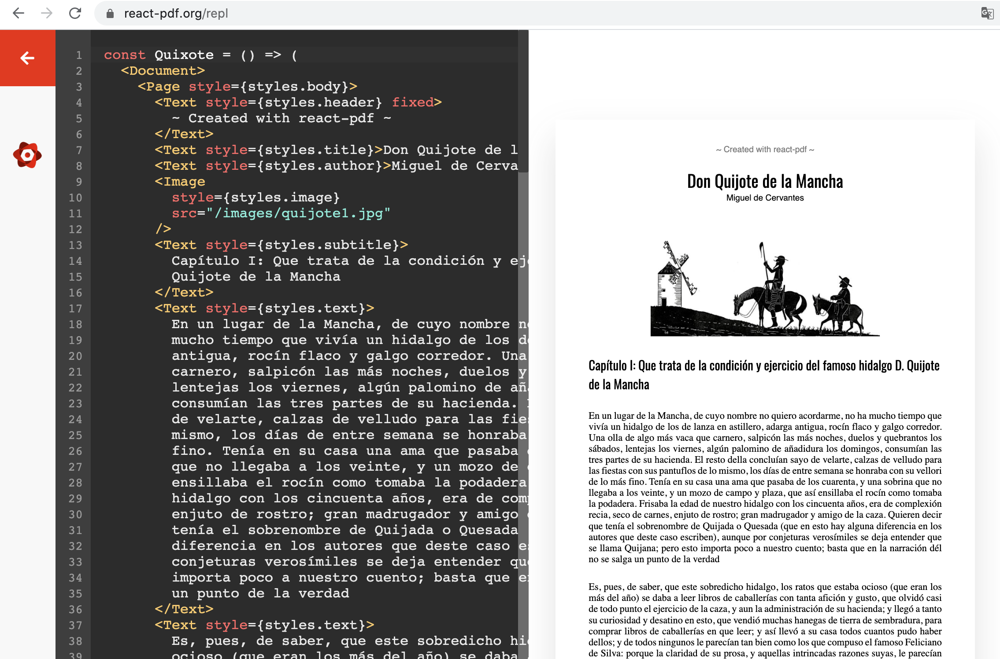
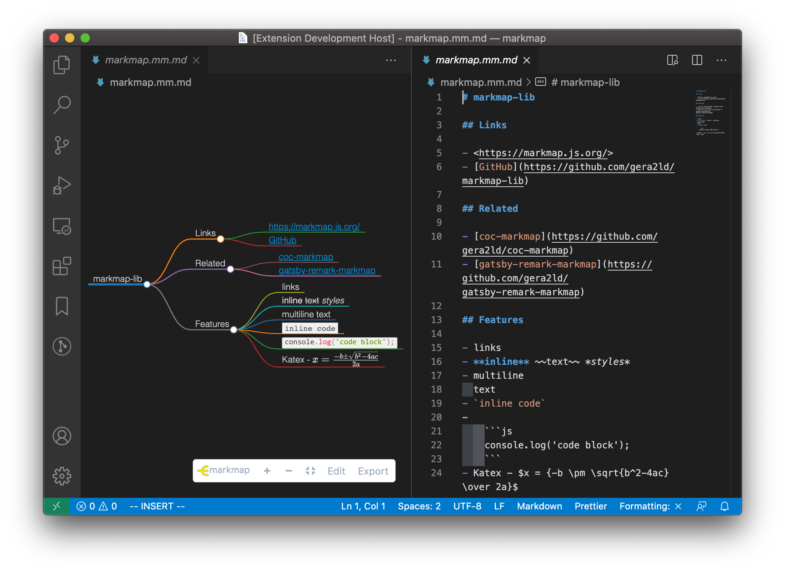

### **1、 [SWR，用于数据请求的 React Hooks 库](https://swr.vercel.app/zh-CN)**

“SWR” 这个名字来自于 stale-while-revalidate：一种由 HTTP RFC 5861 推广的 HTTP 缓存失效策略。

这种策略首先从缓存中返回数据（过期的），同时发送 fetch 请求（重新验证），最后得到最新数据。

- [repo: vercel/swr](https://github.com/vercel/swr)
- [npm: swc](https://npmjs.com/package/swc)

### **2、 [更快的 SSG 静态网站生成器](https://astro.build/)**


超快的、体积超小的网站构建器。

- [repo: withastro/astro](https://github.com/withastro/astro)
- [npm: astro](https://npmjs.com/package/astro)

### **3、 [zustand: 极易上手的 React 状态管理器](https://zustand-demo.pmnd.rs/)**

超简单、超好用的 React 状态管理器。

1. 无需 Context Provider 包裹组件，使用简单方便
1. 主要使用 hooks 消费应用状态
1. 代码简洁，方便，即可几行即可管理全局状态

```js
import create from "zustand";

const useStore = create((set) => ({
  count: 1,
  inc: () => set((state) => ({ count: state.count + 1 })),
}));

function Controls() {
  const inc = useStore((state) => state.inc);
  return <button onClick={inc}>one up</button>;
}

function Counter() {
  const count = useStore((state) => state.count);
  return <h1>{count}</h1>;
}
```

- [repo: pmndrs/zustand](https://github.com/pmndrs/zustand)
- [npm: zustand](https://npmjs.com/package/zustand)

### **4、 [Tauri 新一代桌面开发方式](https://tauri.studio/)**

Tauri 是一个使用 Web 技术构建桌面应用程序的解决方案，后续将会支持 Android/IOS。

与 Electron 相比，它是用 Rust 编写的，它并不依赖于 `Chromium`，也不依赖于 `Node` 与 `v8`。

- [repo: tauri-apps/tauri](https://github.com/tauri-apps/tauri)
- [npm: @tauri-apps/cli](https://npmjs.com/package/@tauri-apps/cli)

### **5、 [zx: 在 nodejs 中调用 shell 更好的工具](https://github.com/google/zx)**

写脚本的最佳方式，强烈推荐!

```js
#!/usr/bin/env zx

await $`cat package.json | grep name`;

let branch = await $`git branch --show-current`;
await $`dep deploy --branch=${branch}`;

await Promise.all([$`sleep 1; echo 1`, $`sleep 2; echo 2`, $`sleep 3; echo 3`]);

let name = "foo bar";
await $`mkdir /tmp/${name}`;
```

- [npm: zx](https://npmjs.com/package/zx)

### **6、 [Create React App 终于支持 webpack5 了](https://github.com/facebook/create-react-app/releases/tag/v5.0.0)**

在 Create-React-App 5.0 中，终于发布了对 webpack5 的支持 (webpack5 已经出来一年了！)

- webpack 5 (#11201)
- Jest 27 (#11338)
- ESLint 8 (#11375)
- PostCSS 8 (#11121)
- Fast Refresh improvements and bug fixes (#11105)
- Support for Tailwind (#11717)
- Improved package manager detection (#11322)
- Unpinned all dependencies for better compatibility with other tools (#11474)
- Dropped support for Node 10 and 12

- [npm: create-react-app](https://npmjs.com/package/create-react-app)

### **7、 [neutralinojs: 轻量的跨平台桌面应用开发框架](https://github.com/neutralinojs/neutralinojs)**

它可以提供轻量的较小体积的跨平台桌面应用开发。

- [npm: @neutralinojs/neu](https://npmjs.com/package/@neutralinojs/neu)

### **8、 [slidev: 使用 Markdown 来写 PPT](https://sli.dev/)**


仅仅通过 Markdown 就可以制作 PPT，slidev 采用了 vite、vue3、windicss 等流行技术栈。并支持在 PPT 中使用 Vue 组件。

```markdown
# Slidev

Hello World

---

# Page 2

Directly use code blocks for highlighting

---

# Page 3
```

- [repo: slidevjs/slidev](https://github.com/slidevjs/slidev)
- [npm: slidev](https://npmjs.com/package/slidev)

### **9、 [javascript-obfuscator: 强有力的 Javascript 混淆器](https://github.com/javascript-obfuscator/javascript-obfuscator)**


- [repo: javascript-obfuscator/javascript-obfuscator](https://github.com/javascript-obfuscator/javascript-obfuscator)
- [npm: javascript-obfuscator](https://npmjs.com/package/javascript-obfuscator)

### **10、 [vizzu: 会动的图表库](https://lib.vizzuhq.com/)**


vizzu 可以在两种形态的图表之间进行动画切换，它使用了 Canvas 进行渲染，并且核心逻辑使用了 C++ 编译为 WASM 使用。

- [repo: vizzuhq/vizzu-lib](https://github.com/vizzuhq/vizzu-lib)
- [npm: vizzu](https://npmjs.com/package/vizzu)

### **11、 [tabulator: 纯 Javascript 交互式表格组件](https://github.com/olifolkerd/tabulator)**


纯 JS 写的交互式表格组件，同时支持 React、Vue、Angular、Svelte 等。

- [repo: olifolkerd/tabulator](https://github.com/olifolkerd/tabulator)
- [npm: tabulator](https://npmjs.com/package/tabulator)

### **12、 [react-location: 另外一个 React 路由库](https://react-location.tanstack.com/)**


```js
import { ReactLocation, Router } from "react-location";

const reactLocation = new ReactLocation();

return (
  <Router
    location={reactLocation}
    routes={[
      {
        path: "/",
        element: "Home on the range!",
      },
    ]}
  />
);
```

另外一个 React 路由的库，你是不已经忍受不了 React Router 经常升级了？

- [repo: tannerlinsley/react-location](https://github.com/tannerlinsley/react-location)
- [npm: react-location](https://npmjs.com/package/react-location)

### **13、 [gpu.js: 加速你的 Javascript 运算性能](https://github.com/gpujs/gpu.js)**

借助于 WebGL，在 GPU 下进行 Javascript 计算，提升性能。

```js
const { GPU } = require("gpu.js");
const gpu = new GPU();
const multiplyMatrix = gpu
  .createKernel(function (a, b) {
    let sum = 0;
    for (let i = 0; i < 512; i++) {
      sum += a[this.thread.y][i] * b[i][this.thread.x];
    }
    return sum;
  })
  .setOutput([512, 512]);

const c = multiplyMatrix(a, b);
```

- [repo: gpujs/gpu.js](https://github.com/gpujs/gpu.js)
- [npm: gpu.js](https://npmjs.com/package/gpu.js)

### **14、 [teaful: 一个小型的 React 全局状态管理器](https://aralroca.com/blog/teaful)**

```js
import createStore from "teaful";

const { useStore } = createStore({
  username: "Aral",
  count: 0,
  age: 31,
  cart: {
    price: 0,
    items: [],
  },
});

function Example() {
  const [username, setUsername] = useStore.username();
  const [cartPrice, setCartPrice] = useStore.cart.price();

  return (
    <>
      <button onClick={() => setUsername("AnotherUserName")}>
        Update {username}
      </button>
      <button onClick={() => setCartPrice((v) => v + 1)}>
        Increment price: {cartPrice}€
      </button>
    </>
  );
}
```

- [repo: teafuljs/teaful](https://github.com/teafuljs/teaful)
- [npm: teaful](https://npmjs.com/package/teaful)

### **15、 [WASM-ImageMagick: WASM 版图像压缩器](https://github.com/KnicKnic/WASM-ImageMagick)**

Webassembly compilation of <https://github.com/ImageMagick/ImageMagick> & samples

- [repo: KniKnic/WASM-ImageMagick](KniKnic/WASM-ImageMagick)
- [npm: WASM-ImageMagick](https://npmjs.com/package/WASM-ImageMagick)

### **16、 [npkill: 找出占用你磁盘体积最大的 node_module 并删掉](https://github.com/voidcosmos/npkill)**


在 Javascript 的世界中，`node_modules` 的体积巨大，占用磁盘巨大，甚至导致笔记本空间不足，无法正常使用。

`npkill` 可帮你找出笔记本所有 `node_modules` 目录并计算出总体积，也可对 `node_modules` 按照其体积降序排列。

`npkill` 支持对列出的列表通过 `j`/`k` 进行上下移动，通过空格键删除其目录。

当然，你可以使用 `pnpm`/`yarn3` 来减小 `node_modules` 的占用体积。

### **17、 [html2canvas: 如何把 HTML 转化为图片](https://html2canvas.hertzen.com/)**


海报、截屏、水印，这些常见的业务需求都离不开一个库，那就是 `html2canvas`。把 DOM 转化为 Canvas，仅仅需要一个 API。

```js
const canvas = await html2canvas(document.querySelector("#capture"));
```

[那你知道 DOM 转为图片的原理是什么吗？](https://github.com/shfshanyue/Daily-Question/issues/437)

大概是基于以下链条

1. DOM -> foreignObject -> SVG -> Canvas -> JPEG/PNG

如果要实现相同的功能，还可以使用以前介绍过的另外一个库。

- [dom-to-image](https://github.com/tsayen/dom-to-image): Generates an image from a DOM node using HTML5 canvas

### **18、 [React Tracking: React 如何设计一个打点并优秀的 API](https://open.nytimes.com/introducing-react-tracking-declarative-tracking-for-react-apps-2c76706bb79a)**

`React-Tracking` 是 React 中一个关于打点的库，目前在 Github 拥有 1K+颗星星。

第一步: 在 React 根组件中，使 `React-Tracking` 位于最顶层，进行全局统一配置，可在这一步与专业打点服务进行对接，如谷歌统计、百度统计、神策统计等。如果你们的打点服务是自研的，也完全可以使用它。

在 `React-Tracking` 中，使用 `dispatch` 函数与专业打点服务进行对接。

```js
const TrackedApp = track(
  // 全局打点数据
  { app: "my-app" },

  // 全局配置
  {
    // dataLayper 为谷歌统计的 API，可在此处与专业打点服务进行对接。
    dispatch: (data) => {
      console.log(data);
      (window.dataLayer = window.dataLayer || []).push(data);
    },
  }
)(App);

const rootElement = document.getElementById("root");
ReactDOM.render(<TrackedApp />, rootElement);
```

第二部：在 React 函数式组件中，使用 `useTracking` 进行打点统计

```js
import { useTracking } from "react-tracking";

const FooPage = () => {
  const { Track, trackEvent } = useTracking({ page: "FooPage" });

  return (
    <Track>
      <div
        onClick={() => {
          trackEvent({ action: "click" });
        }}
      />
    </Track>
  );
};
```

有兴趣的同学，可点击该链接进行尝试。[React-Tracking Example](https://codesandbox.io/s/reacttracking-example-qk30j4x1zj?file=/src/index.js)

### **19、 [React Hot Toast: 有可能是 React 中最好用的提示框组件](https://react-hot-toast.com/)**


是山月认为比较好用的提示框组件，拥有以下特点。体积小、支持 hooks

- 🔥 Hot by default
- 🔩 Easily Customizable
- ⏳ Promise API - Automatic loader from a promise
- 🕊 Lightweight - less than 5kb including styles
- ✅ Accessible
- 🤯 Headless Hooks - Create your own with useToaster()

对于其中支持 Promise 的特性，在实际使用过程中十分好用

```js
const fetchUser = getUser(10086);
toast.promise(
  fetchUser,
  {
    success: "该用户信息获取成功",
    error: "该用户信息获取失败",
    loading: "正在获取该用户信息",
  },
  {
    style: {
      minwidth: "250px",
    },
    success: {
      duration: 5000,
      icon: "🔥",
    },
  }
);
```

- [npm: react-hot-toast](https://npmjs.com/package/react-hot-toast)

### **20、 [create-node-cli: 创建 Node 命令行工具的命令行工具](https://nodecli.com/)**

`create-node-cli` 基于 `meow`、`chalk` 等可交互式地创建一个命令行工具模板。

```bash
# Recommended.
$ npx create-node-cli

# Usage
# Run the CLI using
$ npx create-node-cli

CLI name?
CLI command?
CLI description?
CLI version?
CLI license?
CLI author name?
CLI author email?
```

- [npm: create-node-cli](https://npmjs.com/package/create-node-cli)

### **21、 [simple-keyboard: 一个关于虚拟键盘的组件](https://virtual-keyboard.js.org/)**


你们的产品经理有没有要求你们写一个虚拟键盘，simple-keyboard 是一个使用纯 JS 实现无任何依赖的虚拟键盘组件，它支持以下功能

1. 支持 Vue、React、Svetle、Angular 等 UI 框架
2. 支持 CDN 脚本引入。
3. 支持多种主题配置

- [repo: hodgef/simple-keyboard](https://github.com/hodgef/simple-keyboard)
- [npm: simple-keyboard](https://npmjs.com/package/simple-keyboard)

### **22、 [web-vitals: 核心性能指标监控](https://web.dev/vitals/#core-web-vitals)**

核心性能指标监控

- [repo: GoogleChrome/web-vitals](https://github.com/GoogleChrome/web-vitals)
- [npm: web-vitals](https://npmjs.com/package/web-vitals)

### **23、 [clipboard-copy: 声明式复制到剪切板的轻量库](https://github.com/feross/clipboard-copy)**

```js
const copy = require("clipboard-copy");

copy("hello, world");
```

在浏览器中，如何复制内容到剪贴板？

那就是使用 [clipboard-copy](https://npm.devtool.tech/clipboard-copy) 这个库，月下载量达百万，而大小仅仅只有 `508B`。


与最为流行周下载量达几万的 [clipboard](https://npm.devtool.tech/clipboard) 而言，`clipboard-copy` 的代码更加简洁、声明式使用更加易懂，即使是源码也非常简单，仅仅只有几十行，建议阅读。

- [repo: feross/clipboard-copy](https://github.com/feross/clipboard-copy)
- [npm: clipboard-copy](https://npmjs.com/package/clipboard-copy)

### **24、 [react flow: 使用 React 来构建流程图](https://reactflow.dev/)**


```js
import React from "react";
import ReactFlow from "react-flow-renderer";

const elements = [
  { id: "1", data: { label: "Node 1" }, position: { x: 250, y: 5 } },
  // you can also pass a React component as a label
  { id: "2", data: { label: <div>Node 2</div> }, position: { x: 100, y: 100 } },
  { id: "e1-2", source: "1", target: "2", animated: true },
];

const BasicFlow = () => <ReactFlow elements={elements} />;
```

- [npm: react-flow-renderer](https://npmjs.com/package/react-flow-renderer)

### **25、 [react flow: 使用 React 来构建流程图](https://reactflow.dev/)**


- [repo: wbkd/react-flow](https://github.com/wbkd/react-flow)
- [npm: react-flow-renderer](https://npmjs.com/package/react-flow-renderer)

### **26、 [react-pdf: 使用 React 创建 PDF 文件](https://react-pdf.org/)**



使用 React 直接书写 PDF 文档，但是样式需要使用它自己的写法，不支持 CSS，优势在于支持手动下载并且文档预览与下载后效果一致。

- [repo: diegomura/react-pdf](https://github.com/diegomura/react-pdf)
- [npm: react-pdf](https://npmjs.com/package/react-pdf)

### **27、 [markmap: 使用 Markdown 制作思维导图](https://markmap.js.org/)**


Markmap 利用 Markdown 中的 h1、h2、h3 轻松方便制作思维导图，同时支持 Markdown 的语法，如链接、粗体、斜体之类。你可以在这里 [markmap repl](https://markmap.js.org/repl) 在线尝试



它也可在 VSCode 中集成使用。

- [repo: dundalek/markmap](https://github.com/dundalek/markmap)
- [npm: markmap](https://npmjs.com/package/markmap)

### **28、 [use-debounce: A debounce hook for react](https://github.com/xnimorz/use-debounce)**

防抖可以笨办法防止多次重复计算造成的性能消耗，在 React 中可以使用 `use-debounce` 对函数及值进行防抖

**对值进行防抖**

```js
const [text, setText] = useState("Hello");
const [value] = useDebounce(text, 1000);
```

**对函数进行防抖**

```js
const [value, setValue] = useState(defaultValue);

const debounced = useDebouncedCallback((value) => {
  setValue(value);
}, 1000);
```

- [repo: xnimorz/use-debounce](https://github.com/xnimorz/use-debounce)
- [npm: use-debounce](https://npmjs.com/package/use-debounce)

### **29、 [charts.css](https://chartscss.org/)**

数据可视化一般用 Canvas 完成，或者使用 SVG 完成，它竟然还能使用 CSS 完成，听起来是不有点意思？

charts.css 通过 CSS 来进行数据可视化，在 charts.css 中画图，一般通过 table、css variables 与 class 控制图表

```html
<table class="charts-css column" id="my-chart">
  ...
</table>
```

- [repo: ChartsCSS/charts.css](https://github.com/ChartsCSS/charts.css)
- [npm: charts.css](https://npmjs.com/package/charts.css)

### **30、 [tippy: 最好用的 tooltip 工具](https://atomiks.github.io/tippyjs/)**


一个非常流行的 tooltip 工具，可在 React 中使用，支持多达几十种丰富的选项。

- [repo: atomiks/tippyjs/](https://github.com/atomiks/tippyjs/)
- [npm: tippy.js](https://npmjs.com/package/tippy.js)

### **31、 [storybook: 构建更健壮的 React/Anular/Vue UI 组件](https://storybook.js.org/)**


storybook 可以更高效地组织 React/Angular/Vue 的 UI 组件

- [repo: storybookjs/storybook/](https://github.com/storybookjs/storybook/)

### **32、 [npm-check-updates: 把 package.json 中的依赖升级到最新版本](https://github.com/raineorshine/npm-check-updates)**


npm-check-updates，npm outdated 的升级版本，可以控制把 package.json 中的依赖升级到最新版本

```bash
$ ncu
Checking package.json
[====================] 5/5 100%

express           4.12.x  →   4.13.x
multer            ^0.1.8  →   ^1.0.1
react-bootstrap  ^0.22.6  →  ^0.24.0
react-a11y        ^0.1.1  →   ^0.2.6
webpack          ~1.9.10  →  ~1.10.5

Run ncu -u to upgrade package.json
```

如果希望安全地升级，可以使用 `ncu doctor --doctor`，每升级一个依赖之前都必须成功通过测试用例

- [repo: raineorshine/npm-check-updates](https://github.com/raineorshine/npm-check-updates)
- [npm: npm-check-updates](https://npmjs.com/package/npm-check-updates)

### **33、 [commitlint: Git Commit 格式化工具](https://commitlint.js.org/)**


- [repo: conventional-changelog/commitlint](https://github.com/conventional-changelog/commitlint)
- [npm: @commitlint/cli](https://npmjs.com/package/@commitlint/cli)

### **34、 [Prettier: 代码格式化工具](https://prettier.io/)**

支持多种编程语言，如 html、css、js、graphql、markdown 等并且可与编辑器 (vscode) 深度集成的代码格式化工具


- [repo: prettier/prettier](https://github.com/prettier/prettier)
- [npm: prettier](https://npmjs.com/package/prettier)

### **35、 [jsonld: JS 实现的 JSON-LD 处理器](https://json-ld.org/)**

JSON-LD 是带有 Link Data 的 JSON 数据格式，常见的 mongo 就是以 jsonld 组织数据。

```js
{
  "@context": "https://json-ld.org/contexts/person.jsonld",
  "@id": "http://dbpedia.org/resource/John_Lennon",
  "name": "John Lennon",
  "born": "1940-10-09",
  "spouse": "http://dbpedia.org/resource/Cynthia_Lennon"
}
```

### **36、 [ink: 使用 React 编写命令行工具](https://github.com/vadimdemedes/ink)**


```jsx
import React, { useState, useEffect } from "react";
import { render, Text } from "ink";

const Counter = () => {
  const [counter, setCounter] = useState(0);

  useEffect(() => {
    const timer = setInterval(() => {
      setCounter((previousCounter) => previousCounter + 1);
    }, 100);

    return () => {
      clearInterval(timer);
    };
  }, []);

  return <Text color="green">{counter} tests passed</Text>;
};

render(<Counter />);
```

- [repo: vadimdemedes/ink](https://github.com/vadimdemedes/ink)
- [npm: ink](https://npmjs.com/package/ink)

### **37、 [anime: 轻量高性能 javascript 动画引擎](https://animejs.com/)**


可快速地通过编程制作动画，包括而不限于 SVG、CSS、Keyframes 等。在前几期前端开发者周刊中，也曾介绍过另外一个动画引擎: `GSAP`。

- [repo: juliangarnier/anime](https://github.com/juliangarnier/anime)
- [npm: animejs](https://npmjs.com/package/animejs)

### **38、 [tsdx: 零配置可快速开发 npm package 支持 typescript 的命令行工具](https://tsdx.io/)**


零配置的可快速开发 Package 的命令行工具，开箱即用 Prettier、ESLint、Jest、Rollup、Publish 等繁琐配置化整为零，并可自动打包为 CJS、ESM、UMD 等多个格式而无需多余配置。

如果你开发 React 组件，还可选内置 Storybook 等，为开发新的 Package 造成了极大的便利。

tsdx 为你开发一个 package 提供了开箱即用的最佳实践。

```bash
# 使用 tsdx 快速开发一个 package
$ npx tsdx create mylib
```

- [repo: formium/tsdx](https://github.com/formium/tsdx)
- [npm: tsdx](https://npmjs.com/package/tsdx)

### **39、 [isbot: 判断请求是否一个机器人](https://isbot.js.org/)**

能够有效识别蜘蛛、爬虫等，但不能识别伪装 UA 恶意爬取数据的机器人

- [repo: omrilotan/isbot](https://github.com/omrilotan/isbot)
- [npm: isbot](https://npmjs.com/package/isbot)

### **40、 [tinyhttp: 一个用以替代 express 的轻量 web 框架](https://tinyhttp.v1rtl.site/)**

tinyhttp 创建于九个月前，还是一代很年轻的 http 框架，因为没有任何历史包袱，同时支持 TS，并打包成原生 ESM。它有诸多优点

1. 比 Express 快两倍
1. 支持 Express 的所有中间件
1. 没有历史包袱，支持 ESM 与 TS
1. 预定常见中间件，如 logger、router 等

tinyhttp 能不能替代 express，让我们拭目以待吧 (应该不能)

- [repo: talentlessguy/tinyhttp](https://github.com/talentlessguy/tinyhttp)
- [npm: tinyhttp](https://npmjs.com/package/tinyhttp)

### **41、 [docusaurus: facebook 出品文档化工具](https://v2.docusaurus.io/)**


facebook 出品的文档化工具，在 Github 已经有两万颗星星，基于 React 可轻松扩展页面，定制能力较强。

- [repo: facebook/docusaurus](https://github.com/facebook/docusaurus)
- [npm: docusaurus](https://npmjs.com/package/docusaurus)

### **42、 [nodegui: 使用前端开发跨端桌面应用](https://docs.nodegui.org/)**


使用前端技术基于 QT5 的桌面跨端解决方案，可以使用 React/Vue/Svelte 框架来开发跨端应用

- [repo: nodegui/nodegui](https://github.com/nodegui/nodegui)
- [npm: @nodegui/nodegui](https://npmjs.com/package/@nodegui/nodegui)

### **43、 [bytemd: 字节出品 Markdown 编辑器](https://bytemd.netlify.app/)**


字节出品的 Markdown 编辑器，由 Svelte 构建，同时支持 React/Vue 组件等，支持公式(math)、脚注(footnote)、流程图(mermaid)等复杂富文本内容。另外，掘金社区的编辑器也是基于此构建

bytemd 基于最流行的 Markdown 解析器 `remark`与 最受欢迎的便捷器 `codemirror`，基于流行库，拥有更强的扩展能力，你很容易扩展 Plugin，如微信脚注、多样主题等

- [npm: bytemd](https://npmjs.com/package/bytemd)

### **44、 [undici: 使用 Node 从零开发的 HTTP/1.1 客户端](https://github.com/nodejs/undici)**

```js
import { request } from "undici";

const { statusCode, headers, trailers, body } = await request(
  "http://localhost:3000/foo"
);

console.log("response received", statusCode);
console.log("headers", headers);
```

nodejs 官方发布，从头写一个 HTTP/1.1 客户端

- [repo: nodejs/undici](https://github.com/nodejs/undici)
- [npm: undici](https://npmjs.com/package/undici)

### **45、 [np: 更好更安全的 npm publish](https://github.com/sindresorhus/np)**


一个更安全的 npm publish，比如发包之前需要通过单元测试，支持 2FA 等。

- [repo: sindresorhus/np](https://github.com/sindresorhus/np)
- [npm: np](https://npmjs.com/package/np)

### **46、 [size-limit: 控制你的 Package/Bundle 大小](https://github.com/ai/size-limit)**

无论是开发一个前端应用还是发布一个 npm package，它的包大小是敏感且重要的，实为开发者一大利器。

使用 size-limit 可在 git hooks 或者 CI 中控制发布包的大小 (可配置 gzip 或者 brotli 压缩算法)，及浏览器中 JS 的下载及执行时间。

你既可以在 `git hooks` 中使用


也可以在 `CI` 中使用，如 `github actions`、`Gitlab CI`


- [repo: ai/size-limit](https://github.com/ai/size-limit)
- [npm: size-limit](https://npmjs.com/package/size-limit)

### **47、 [pnpm: 更快、占用空间更小的包管理器](https://github.com/pnpm/pnpm)**

使用 npm、yarn 及 pnpm 下载 React 时的 Benchmark，可见 pnpm 比其它包管理工具要快两倍


从图中，也可以看出 npm v7 性能比 yarn 有更好的性能

- [repo: pnpm/pnpm](https://github.com/pnpm/pnpm)
- [npm: pnpm](https://npmjs.com/package/pnpm)

### **48、 [popperjs: 轻量可定制化的 Tooltip 工具库](https://popper.js.org/)**

仅仅只有 3KB 大小，无任何依赖的轻量级 tooltip 工具库，支持 TS，非常流行，每个月有 3500 万次下载。

- [repo: popperjs/popper-core](https://github.com/popperjs/popper-core)
- [npm: @popperjs/core](https://npmjs.com/package/@popperjs/core)

### **49、 [multiavatar: 自动生成多元化头像](https://multiavatar.com/)**

可根据名称自动生成多元化的头像


- [repo: multiavatar/Multiavatar](https://github.com/multiavatar/Multiavatar)
- [npm: @multiavatar/multiavatar](https://npmjs.com/package/@multiavatar/multiavatar)
