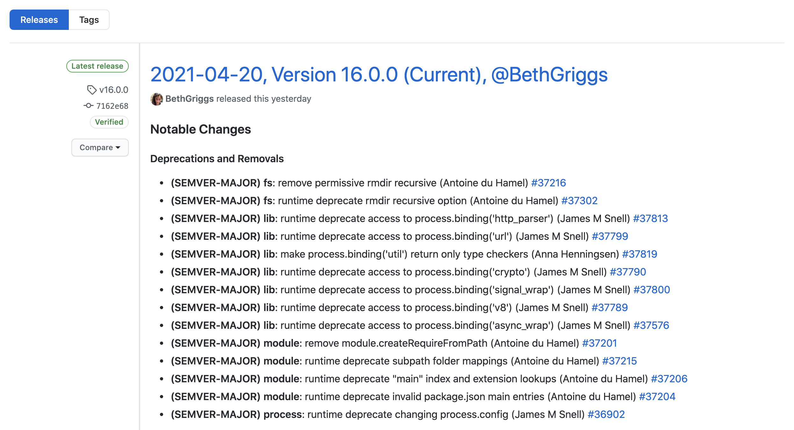

# Node 16 发布，一大堆新特性来袭


Node 16 于四月二十日发布，山月在第一时间下载了 Node16 体验了以下新特性。偶数号的版本为 LTS 版本，这将是既 Node14 之后的下一个长期支持版本，Node14 在 2020-10-27 已进入 `Active LTS` 阶段，还没有升级的同学要尽量更新呀。



从[Node 16 Release 官方文档](https://github.com/nodejs/node/releases/tag/v16.0.0) 列出了此次它所有的新特性以及非常详细的提交记录。那它到底更新了哪些新特性，先让我们一睹为快吧！

## Timers Promise API

`Timers Promise API` 其实在 Node15 就已存在，那时候是一个实验特性，目前已进入了稳定阶段，是一项令人兴奋的特性。那它到底是干什么用的呢？

先别急，在此之前，先看一个问题：[如何实现一个 sleep/delay 函数？](https://q.shanyue.tech/fe/js/442.html)

答案也很简单，使用 Promise 封装一个 `setTimeout` 即可

``` js
const sleep = (t = 0) => new Promise(resolve => setTimeout(resolve, t));
```

那有了 `Timers Promise` 之后呢，使用 `setTimeout` 直接可替代 sleep 功能，惊不惊喜。

``` js
import { setTimeout } from 'timers/promises'

await setTimeout(100)
```

`setTimeout` 的第二个参数接收一个值，作为 Promise 成功后的返回值

``` js
const r = await setTimeout(100, 'hello, world)

//=> hello, world
console.log(r)
```

而当 `setInterval` 也变为 Promise 形式后，对于每间隔一分钟便执行操作的定时任务而言，具有更大的可读性

``` js
import { setInterval } from 'timers/promises'

for await (const startTime of setInterval(100, Date.now())) {
  const now = Date.now()
  if ((now - startTime) > 1000)
    break
}
```

## 底层依赖升级

我们知道，Node 基于 v8、libuv、llhttp 等诸多依赖，这次它对诸多依赖进行了升级。如同我们的业务项目依赖于诸多软件包，每一次依赖的升级也会对性能造成不少提升

+ v8, 升级到 9.0，主要是 ECMAScript RegExp Match Indices
+ llhttp, 升级到 6.0.0，用以解析 HTTP 报文
+ icu, 升级到 69.1
+ npm, 升级到 7.10.0

使用 `process.versions` 可看到相关依赖的版本号

``` js
> process.versions
{
  node: '16.0.0',
  v8: '9.0.257.17-node.10',
  uv: '1.41.0',
  zlib: '1.2.11',
  brotli: '1.0.9',
  ares: '1.17.1',
  modules: '93',
  nghttp2: '1.42.0',
  napi: '8',
  llhttp: '6.0.0',
  openssl: '1.1.1k+quic',
  cldr: '39.0',
  icu: '69.1',
  tz: '2021a',
  unicode: '13.0',
  ngtcp2: '0.1.0-DEV',
  nghttp3: '0.1.0-DEV'
}
```

## btoa 与 atob

关于 Base64 的转化，Node 在以前使用了 `Buffer.from`，而现在支持 btoa/atob 与浏览器环境保持了一致。

而对于一个 SSR 项目而言，执行环境的区分将无关紧要，统一使用 `btoa/atob` 就好了

``` js
const base64 = {
  encode (v: string) {
    return isBrowser ? btoa(v) : Buffer.from(v).toString('base64')
  },
  decode (v: string) {
    return isBrowser ? atob(v) : Buffer.from(v, 'base64').toString()
  }
}
```

## 更多

关于 Node16 升级的诸多小细节，可参阅[版本发布](https://github.com/nodejs/node/releases/tag/v16.0.0)获取更多信息，可持续关注[山月周刊](https://weekly.shanyue.tech/) 订阅对各软件每一次重大版本升级的说明讲解，下一个版本升级时再见