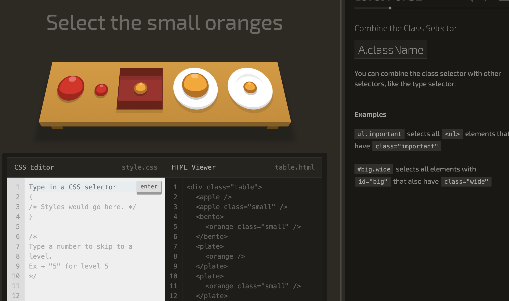
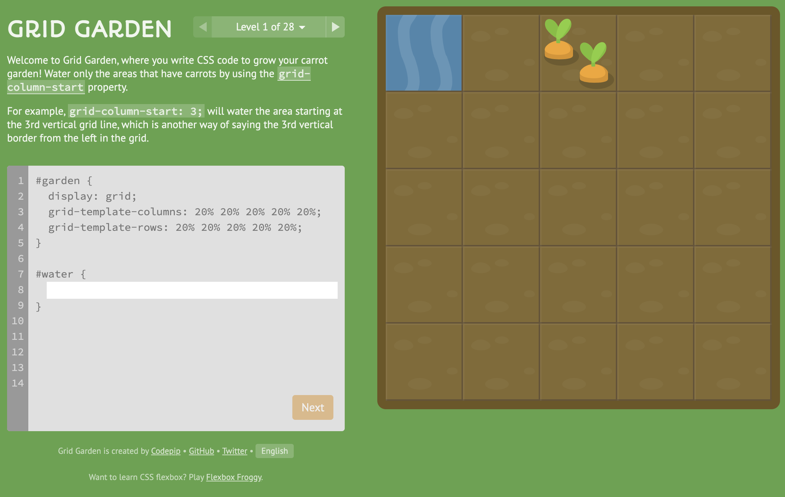
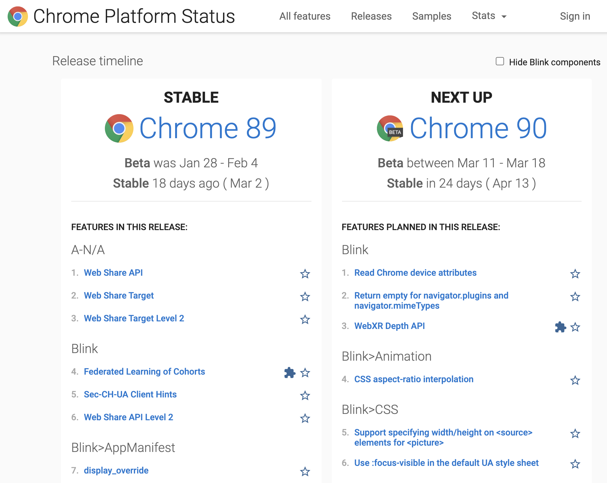

### **1、 [sshshape: 简单几个点画出漂亮图形](https://fffuel.co/ssshape/)**


通过几个点就可以画出漂亮的 SVG 图形。

### **2、 [Image Tool 纯网页端的图像压缩工具](https://renzhezhilu.github.io/webp2jpg-online/#/)**


颜值高、功能强大，使用 WASM 的纯网页端的图像压缩工具

- [repo: renzhezhilu/webp2jpg-online](renzhezhilu/webp2jpg-online)

### **3、 [Rclone: 支持多个云存储的，高性能的文件同步工具](https://rclone.org/)**


Rclone，rsync for cloud storage，是使用 Go 语言编写的一款高性能云文件同步的命令行工具，可理解为云存储版本的 rsync。

1. 支持多个云存储，如阿里云、腾讯与、青云、AWS 等
1. 支持按需复制，每次仅仅复制更改的文件
1. 可断点续传
1. 可压缩传输

```bash
# 安装 Rclone
$ curl https://rclone.org/install.sh | bash

# 配置 Rclone 的云存储器交互式配置，如配置阿里云的 key/secret
$ rclone config

# 配置结束之后在本机生成配置文件，可查看目录 ~/.config
$ cat ~/.config/rclone/rclone.conf
[alioss]
type = s3
provider = Alibaba
env_auth = true
access_key_id = *********************
secret_access_key = *********************
endpoint = oss-cn-beijing.aliyuncs.com
acl = public-read
storage_class = STANDARD

# 列出所有的 bucket
$ rclone lsd alioss:/
      -1 2018-11-14 21:34:17        -1 shanyue
      -1 2019-11-23 13:54:28        -1 shanyue-blog
      -1 2020-01-27 15:06:08        -1 shanyue-ncov
      -1 2019-12-02 17:48:42        -1 shanyue-question

# 复制文件，以 vuepress 为示例
$ rclone copy .vuepress/dist alioss:/shanyue-blog --progress
Transferred:              0 B / 0 B, -, 0 B/s, ETA -
Checks:              1099 / 1099, 100%
Elapsed time:         3.8s

# 对比远程文件与现在文件的区别
$ rclone copy .vuepress/dist alioss:/shanyue-blog --progress
```

**现在前端静态资源大多扔在对象存储之上，如阿里云的 OSS，腾讯云的 COS 等，使用 Rclone 大大降低传输时间，并大大缩短前端的部署时间。**

### **4、 [hasty](https://hasty.dev/)**

### **5、 [微图床](https://devtool.tech/gallery)**

### **6、 [AVPress: 纯网页端压缩你的视频资源](https://avpress.zaps.dev/)**


使用 WASM 在纯前端，而非依赖后端接口去压缩视频资源。

### **7、 [微图: 纯前端压缩你的图片资源](https://devtool.tech/tiny-image)**


不限图片大小，不限图片数量，并可转化我 webp/avif 的图片压缩工具。

### **8、 [tailwind play: 实时编辑测试并学习 TailwindCSS 的编辑器](https://play.tailwindcss.com/)**


在 TailWind Play 中，你可以编辑 tailwindcss 代码，并实时查看效果。在其中，你可以编辑 tailwindcss 配置，同时，你还可以把代码生成唯一地址进行分享。

TailWind Play 使得学习 tailwindcss 的成本变得很低，如果你久闻 tailwindcss 大名却还没有使用过它，可以在上边试一试

### **9、 [The CanIUse Embed](https://caniuse.bitsofco.de/)**


把 CanIUse 通过 Frame/Image 格式嵌入到博客中的一个工具。

### **10、 [Learn CSS](https://web.dev/learn/css/)**


谷歌官方出品的 CSS 核心技能构建，浅显易懂，易于上手。

每一章节都伴随有可编辑的 DEMO 可供学习，并提供题目测试你的学习成果。

### **11、 [HTML5 Text Editor](https://github.com/GoogleChromeLabs/text-editor)**

基于 `File System Access API` 的文本编辑器

- [repo: GoogleChromeLabs/text-editor](https://github.com/GoogleChromeLabs/text-editor)

### **12、 [devhints](https://devhints.io/)**

CheatSheets 大全

- [repo: rstacruz/cheatsheets](https://github.com/rstacruz/cheatsheets)

### **13、 [Lighthouse Metrics](https://lighthouse-metrics.com/)**

基于 Lighthouse 的全球性的性能测试

### **14、 [Code To Graph](https://crubier.github.io/code-to-graph/)**

### **15、 [npm 依赖可视化](https://npm.anvaka.com/)**

图解动画演示某一个 npm package 所有依赖，已开源 [anvaka/npmgraph](https://github.com/anvaka/npmgraph.an)，技术栈 `angular.js`、`browserify` 与 `gulp`

- [repo: anvaka/npmgraph.an](https://github.com/anvaka/npmgraph.an)

### **16、 [commonmark.js dingus](https://spec.commonmark.org/dingus/ 标准 markdown 语法 commonmark 如何正确的把 Markdown 转化为 HTML)**

### **17、 [Gitlen](https://marketplace.visualstudio.com/items?itemName=eamodio.gitlens)**

VSCode 中最好用的 Git 可视化工具

### **18、 [CSS Grid Generator](https://cssgrid-generator.netlify.app/)**


在网格中进行拖拽选择区域，一键生成 Grid 的 CSS 与 HTML 代码，简单方便，快来试一试吧。

### **19、 [Vim 大冒险](https://vim-adventures.com/)**


Vim 大冒险，一个 Web 游戏，通过闯关的模式学习 Vim，你可以学到 Vim 的基本操作后在这里不停闯关，练习 Vim 的熟练度。山月已经跑到最后一关，免费关的最后一关。后续关卡就要进行收费，如果是付费用户，可以...共享给我

### **20、 [CSS Dinner: 游戏中学习 CSS3 选择器](https://flukeout.github.io/)**



这是一个有关 CSS 高级选择器的游戏，相信你通关成功后会对 CSS 选择器融会贯通吧。

### **21、 [Grid Garden: 游戏中学习 Grid](https://cssgridgarden.com/)**



公园浇花的游戏，与青蛙回家一样有意思，使用 grid 布局把水浇在在与出现花的方格土地上，游戏中会提示你使用正确的 CSS 属性及释义，难度中等。通过玩游戏的方式愉快学习 grid 布局，可以大幅提升学习效率

如果我来做一个 flex 与 grid 布局的游戏，那我应该设计一个什么样的场景呢

- [repo: thomaspark/gridgarden/](https://github.com/thomaspark/gridgarden/)

### **22、 [Flexbox Froggy: 游戏中学习 Flex](https://flexboxfroggy.com/)**


青蛙回家的游戏，使用 flex 布局把青蛙放置在与它对应颜色的草地上，游戏中会提示你使用正确的 CSS 属性及释义，难度中等。通过玩游戏的方式愉快学习 flexbox，可以大幅提升学习效率

- [repo: thomaspark/flexboxfroggy/](https://github.com/thomaspark/flexboxfroggy/)

### **23、 [Githug: 命令行式 Git 闯关游戏](https://github.com/Gazler/githug)**


同 `learngitbranch` 类似，但它是一个命令行式游戏，并使用 ruby 编写，同样很有趣味，快来练练手吧。

- [repo: Gazler/githug](https://github.com/Gazler/githug)

### **24、 [Learning Git Branch: 学习 Git 最好的游戏及教程](https://learngitbranching.js.org/)**


这个就是那个超强的动画游戏趣味俱佳的 Git 闯关游戏！无论对于新人而言，还是老人来讲，都能从中受益，更能理解 Git 的核心，是山月认为的最好的关于学习 Git 的教程。

**当你每敲入一个 Git 命令，都会以动画的形式在右侧区域展现出来，更为难得的是它以闯关的模式一步步从 git commit 由浅入深引导着你来学习**

在游戏中，你可以随时通过命令 `levels` 来选择关卡，爆赞！

- [repo: pcottle/learnGitBranching](https://github.com/pcottle/learnGitBranching)

### **25、 [Web Developer 浏览器插件](https://chrispederick.com/work/web-developer/)**


一款服务于 Web 开发者的浏览器插件，可以针对该网站做更深入的操作，如

1. 禁止 Javascript
1. 禁止 CSS
1. 显示页面所有图片
1. ...

### **26、 [Emmet: Web 开发者的利器](https://emmet.io/)**


高效的前端开发利器，可在 Vue/React 中快速书写修改 HTML/CSS，并支持多种编辑器，如流行的 VSCode。

它最大的功能就是把 `CSS 样式的缩写` 转化为 HTML，如输入 `#page>(#header>ul#nav>li*4>a)+(#content>h1{Hello world}+p)+#footer`，并按下 Tab 键，自动生成以下 HTML

```html
<div id="page">
  <div id="header">
    <ul id="nav">
      <li><a href=""></a></li>
      <li><a href=""></a></li>
      <li><a href=""></a></li>
      <li><a href=""></a></li>
    </ul>
  </div>
  <div id="content">
    <h1>Hello world</h1>
    <p></p>
  </div>
  <div id="footer"></div>
</div>
```

以上扩展缩写的功能被称为 `Expand Abbreviation`。除此之外，它还有更多细致的功能，这些功能在 Emmet 中被称为 `Action`

1. 去除最外层标签
1. 包裹选中的标签
1. ...

- [repo: emmetio/emmet](https://github.com/emmetio/emmet)
- [npm: emmet](https://npmjs.com/package/emmet)

### **27、 [URL-encoder for SVG](https://yoksel.github.io/url-encoder/)**


把 SVG 转化为 DataURI，并嵌入到 CSS 样式中

### **28、 [Svg Viewer](https://www.svgviewer.dev/)**


可视化 SVG，并支持压缩图片、转化为 React/RN 组件、转化为 png 格式的图片等

### **29、 [svg-term-cli: 把终端操作录制为 SVG 动画](https://github.com/marionebl/svg-term-cli)**


基于 asciinema 的一款软件，使用 javascript 编写。可把终端动作录制为 svg 动画

```bash
$ cat demo.cast | svg-term > demo.svg
```

- [repo: marionebl/svg-term-cli](https://github.com/marionebl/svg-term-cli)
- [npm: svg-term-cli](https://npmjs.com/package/svg-term-cli)

### **30、 [asciinema: 终端动作录制软件](https://asciinema.org/)**

使用 python 编写的一款可记录终端操作命令动画的工具软件，可在线播放。借助第三方工具可以转化为 gif 动画或者 svg 动画。

使用以下两行命令可快速开始录制终端。

```bash
$ brew install asciinema

$ asciinema rec
```

- [repo: asciinema/asciinema](https://github.com/asciinema/asciinema)

### **31、 [Prettier Playground: 任意语言代码格式化](https://prettier.io/playground/)**


Prettier 是一款优秀的代码格式化工具


### **32、 [Chrome Platform Status: Chrome 发布版本新特性大览](https://www.chromestatus.com/features/schedule)**



列举每一个 Chrome 的新特性大全，目前的稳定版本及下一个版本的发布日期等。

### **33、 [cssffects: 多种超实用 CSS 动画](https://emilkowalski.github.io/css-effects-snippets/)**


收集多种 CSS 动画，大部分是各种 hover 效果、loading 动画等，纯 CSS 实现。收藏以备独立设计网站时的不时之需。

- [repo: emilkowalski/css-effects-snippets](https://github.com/emilkowalski/css-effects-snippets)

### **34、 [SVG Wave Generator](https://www.softr.io/tools/svg-wave-generator)**


随机生成一个波浪 SVG，可调整锯齿、波折程度等，并可保存为 SVG/PNG/JPG

### **35、 [Explain Shell: 图示任一命令行每个参数的释义](https://explainshell.com/)**


可称之为学习及书写 shell 的最佳辅助神器，输入任一 linux 命令，都会一一指出每个参数的释义，PIPE 嵌套且复杂的命令也可解析。

### **36、 [Browser Logos: 浏览器高清分辨率 Logo](https://github.com/alrra/browser-logos)**


这是 Github 的一个仓库，你可以直接引用地址，找到任意浏览器高清分辨率的 Logo。

如果引用 Github 地址比较慢的话，你可以试试 jsdelivr 的 [CDN](https://cdn.jsdelivr.net/gh/alrra/browser-logos/src/chrome/chrome_64x64.png)

### **37、 [User Agents: 关于 UA 的一切](https://user-agents.net/)**


拥有大量 UA 的数据库及相关功能

- 可获取任意平台的 UA (Mac/Windows/Android)
- 可获取任意 Spider/Crawer 的 UA (Baidu/Google/Bing)
- 可随机生成 UA
- 可解析 UA

### **38、 [risingstars: 2020 年 Javascript 明星项目](https://risingstars.js.org/2020/zh)**

2021 年，JS 各个生态圈中最流行的框架及周边产物，如 React 生态圈、Vue 生态圈、GraphQL 生态圈、构建工具生态圈等

### **39、 [Lorem Picsum: 随机一张指定尺寸图片 API](https://picsum.photos/)**


`https://picsum.photos/200/200` 将随机从 Unsplash 取一张指定尺寸的图片

- [repo: DMarby/picsum-photos](https://github.com/DMarby/picsum-photos)

### **40、 [bestofjs: 发现 Javascript 最好的框架与库](https://bestofjs.org/)**

这里有 JS 生态最流行的库，实时刷新并推荐，并且可每周订阅

- [repo: ritz078/transform](https://github.com/ritz078/transform)

### **41、 [TableConvert: 关于表格及任意格式的双向转换](https://tableconvert.com/)**


支持 Excel、URL、HTML、Markdown、CSV、JSON、LaTeX、SQL、MediaWiki 等任意格式的相互转换

### **42、 [transform: 编程语言任意格式转化](https://transform.tools/)**


支持各种代码转化的工具，SVG、JSON、TS、GraphQL、CSS、SQL，只要你能想到的这里都有。

**光 JSON 就可以转化为十几种代码格式，如把 JSON 转化成 Flow、Go、GraphQL、Typescript、Kotlin、MySQL、YAML 等**

本项目开源，你可以通过代码学习到它是如何进行格式转换的

- [repo: ritz078/transform](https://github.com/ritz078/transform)
