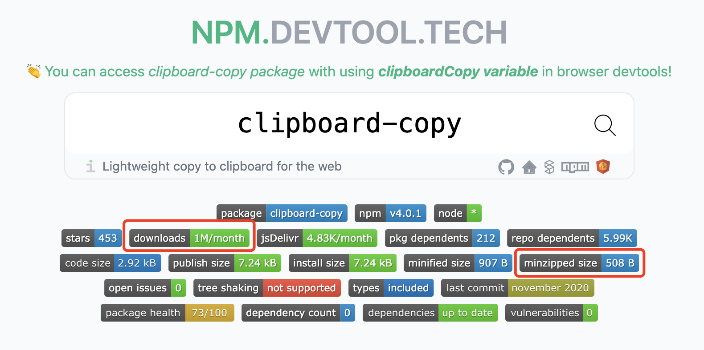
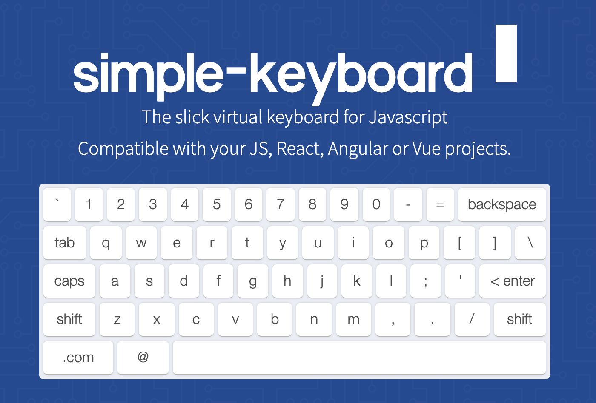

前端爱好者周刊 (Github: shfshanyue/weekly)，每周记录关于前端的开源工具、优秀文章、重大库版本发布记录等等，周刊中优秀文章会在公众号**全栈成长之路**逐一推送。每周一发布，订阅平台如下，欢迎订阅。

- 订阅网站: <https://weekly.shanyue.tech>
- 订阅Github: [shfshanyue/weekly](https://github.com/shfshanyue/weekly)
- [点击在微信订阅](https://mp.weixin.qq.com/mp/appmsgalbum?action=getalbum&__biz=MjM5NjU5NjQ0NQ==&scene=1&album_id=1880625492081344514&count=3#wechat_redirect)

- npm prepare 可在 npm install 之后做一些准备工作

## 文章推荐

### 一、 [Introducing WebContainers: Run Node.js natively in your browser](https://blog.stackblitz.com/posts/introducing-webcontainers/)

Stackblitz 发布了一款新产品: Web Container.

它借助于 WebAssembly 与新的 [capabilities APIs](https://web.dev/fugu-status/) 把虚拟的 Node 环境运行在了浏览器端。

## 开源与库

### 一、 [clipboard-copy: 声明式复制到剪切板的轻量库](https://github.com/feross/clipboard-copy)

```js
const copy = require("clipboard-copy");

copy("hello, world");
```

在浏览器中，如何复制内容到剪贴板？

那就是使用 [clipboard-copy](https://npm.devtool.tech/clipboard-copy) 这个库，月下载量达百万，而大小仅仅只有 `508B`。



与最为流行周下载量达几万的 [clipboard](https://npm.devtool.tech/clipboard) 而言，`clipboard-copy` 的代码更加简洁、声明式使用更加易懂，即使是源码也非常简单，仅仅只有几十行，建议阅读。

- [repo: feross/clipboard-copy](https://github.com/feross/clipboard-copy)
- [npm: clipboard-copy](https://npm.devtool.tech/clipboard-copy)

### 二、 [web-vitals: 核心性能指标监控](https://web.dev/vitals/#core-web-vitals)

核心性能指标监控

- [repo: GoogleChrome/web-vitals](https://github.com/GoogleChrome/web-vitals)
- [npm: web-vitals](https://npm.devtool.tech/web-vitals)

### 三、 [simple-keyboard: 一个关于虚拟键盘的组件](https://virtual-keyboard.js.org/)



你们的产品经理有没有要求你们写一个虚拟键盘，simple-keyboard 是一个使用纯JS实现无任何依赖的虚拟键盘组件，它支持以下功能

1. 支持 Vue、React、Svetle、Angular 等UI框架
2. 支持 CDN 脚本引入。
3. 支持多种主题配置

- [repo: hodgef/simple-keyboard](https://github.com/hodgef/simple-keyboard)
- [npm: simple-keyboard](https://npm.devtool.tech/simple-keyboard)

## 开发利器

### 一、 [Lighthouse Metrics](https://lighthouse-metrics.com/)

基于 Lighthouse 的全球性的性能测试

### 二、 [devhints](https://devhints.io/)

CheatSheets 大全

- [repo: rstacruz/cheatsheets](https://github.com/rstacruz/cheatsheets)

### 三、 [HTML5 Text Editor](https://github.com/GoogleChromeLabs/text-editor)

基于 `File System Access API` 的文本编辑器

- [repo: GoogleChromeLabs/text-editor](https://github.com/GoogleChromeLabs/text-editor)

## 版本发布
