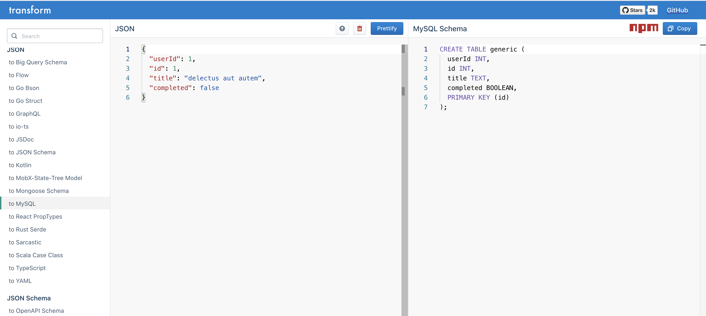
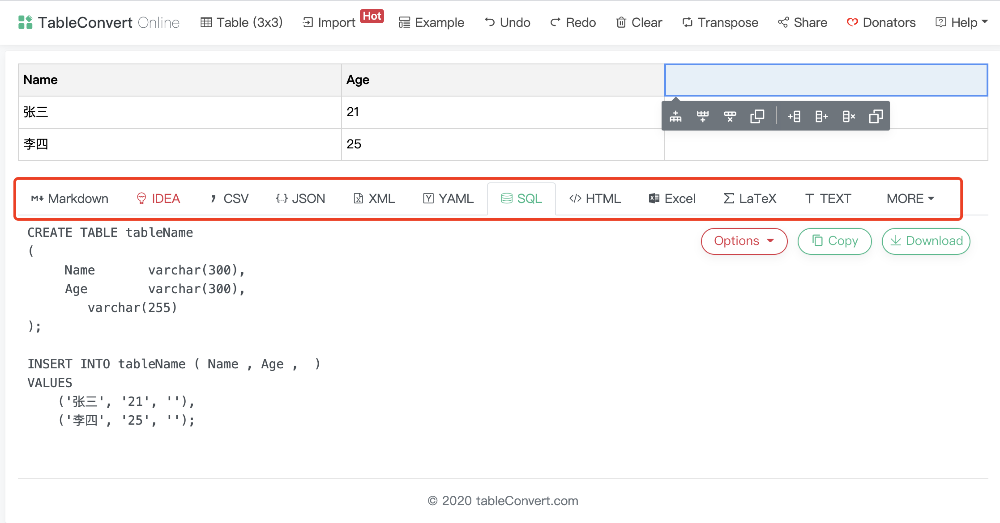

前端爱好者周刊 (Github: shfshanyue/weekly)，每周记录关于前端的开源工具、优秀文章、重大库版本发布记录等等，周刊中优秀文章会在公众号**全栈成长之路**逐一推送。每周一发布，订阅平台如下，欢迎订阅。

+ 订阅网站: <https://weekly.shanyue.tech>
+ 订阅Github: [shfshanyue/weekly](https://github.com/shfshanyue/weekly)


## 封面


国家航天局发布由我国首次火星探测任务**天问一号**探测器拍摄的高清火星影像图，总共有两张黑白图像与一张彩色图像。图示黑白图像在距离火星表面 330 公里高处拍摄。


## 一句话

+ `requests` (一个著名流行的请求库)已处于 `deprecated` 状态，但每月仍有 110M 次下载，而 React 仅有 41M 次下载
+ `npm repo react` 可快速跳转到 React 的 Github 仓库，`npm docs react` 可快速跳转到 React 的官网
+ `npm` 最新版本是 `v7.6`，可支持 `yarn.lock`，当 `npm i` 且有 `yarn.lock` 文件时会自动写入 lockfile，因此**赶快升级 npm 到 v7 版本吧**
+ `node v10` 维护期截止到 2021.04.30，现在是时候升级到 node v12 了
+ `npx` 可代替 JS 全局模块安装，如 `npx create-react-app`
+ `node` Repo 的[最近一个 Issue](https://github.com/nodejs/node/issues/37583) 中提到, `fs.promises.readFile` 比 `fs.readFile` 慢 40%
+ 2020年，全国国内生产总值达 101.6 万亿元，比上年增长 2.3%，2021 目标 GPD 增速 6%
+ 2020年，全国居民人均消费支出 21210 元，比上年下降 1.6%，扣除价格因素，实际下降 4%
+ 2020年末互联网上网人数 9.89 亿人，其中手机上网人数 9.86 亿人
+ 从2021年起，作为全国汽车产业基地之一的吉林省长春市将**加速出行方式电动化步伐**，出租车和公务车原则上不再增加或更新燃油车
+ 银保监会消息，2020年房地产贷款增速8年来首次低于各项贷款增速
+ 我国特有珍稀濒危野生动物大熊猫和朱鹮实现恢复性增长

## 开发利器


### **一、 [transform: 编程语言任意格式转化](https://transform.tools/)**



支持各种代码转化的工具，SVG、JSON、TS、GraphQL、CSS、SQL，只要你能想到的这里都有。**光 JSON 就可以转化为十几种代码格式。**


+ [repo: ritz078/transform](https://github.com/ritz078/transform)


    

### **二、 [TableConvert: 关于表格及任意格式的双向转换](https://tableconvert.com/)**



支持 Excel、URL、HTML、Markdown、CSV、JSON、LaTeX、SQL、MediaWiki等任意格式的相互转换


    

## 文章推荐


### **一、 [深入 ESM 图解](https://hacks.mozilla.org/2018/03/es-modules-a-cartoon-deep-dive/)**

当前，在浏览器中通过 `<script type="module">` 已原生支持 ESM，你可以在 `vite` 或者 `snowpack` 中尝试一下

本文用图解的方式深入讲解了 ESM 的工作原理。

在平常工作中，使用 `import/export` 开发模块，此时会以入口节点为根节点呈现出一张依赖关系图:


浏览器会解析文件，根据 `import/export` 语句构成模块记录(`Module Record`)


一个 ESM 执行需要经过构建(Constructor)、实例化(Instantiation)和运行(Evaluation)三步


+ [跳转译文](https://segmentfault.com/a/1190000014318751)
    

### **二、 [像大佬一样使用 Google 搜索](https://dev.to/denicmarko/google-like-a-pro-5cf6)**

`-` 减号排除关键字


`""` 双引号精确搜索


+ [跳转译文](https://juejin.cn/post/6934478610518507528)
    

### **三、 [十分钟教你用svg做出精美的动画！](https://juejin.cn/post/6930412294149472269)**


如何快速制作出精美的 SVG 动画？

第一步：找一个 SVG

第二步：分解 SVG 的 Path

第二步：使用 GSAP 库编程把 SVG 动起来


    

## 开源与库


### **一、 [size-limit: 控制你的 Package/Bundle 大小](https://github.com/ai/size-limit)**

无论是开发一个前端应用还是发布一个 npm package，它的包大小是敏感且重要的，实为开发者一大利器。

使用 size-limit 可在 git hooks 或者 CI 中控制发布包的大小 (可配置 gzip 或者 brotli 压缩算法)，及浏览器中 JS 的下载及执行时间。

你既可以在 `git hooks` 中使用


也可以在 `CI` 中使用，如 `github actions`、`Gitlab CI`


+ [repo: ai/size-limit](https://github.com/ai/size-limit)
+ [npm: size-limit](https://npmjs.com/package/undefined)

    

### **二、 [np: 更好更安全的 npm publish](https://github.com/sindresorhus/np)**


一个更安全的 npm publish，比如发包之前需要通过单元测试，支持2FA等。


+ [repo: sindresorhus/np](https://github.com/sindresorhus/np)
+ [npm: np](https://npmjs.com/package/undefined)

    

### **三、 [undici: 使用 Node 从零开发的 HTTP/1.1 客户端](https://github.com/nodejs/undici)**

``` js
import { request } from 'undici'

const {
  statusCode,
  headers,
  trailers,
  body
} = await request('http://localhost:3000/foo')

console.log('response received', statusCode)
console.log('headers', headers)
```

nodejs 官方发布，从头写一个 HTTP/1.1 客户端


+ [repo: nodejs/undici](https://github.com/nodejs/undici)
+ [npm: undici](https://npmjs.com/package/undefined)

    

## 版本发布


### **一、 [Gatsby 3.0 Released](https://www.gatsbyjs.com/blog/gatsby-v3/)**

Gatsby 是一款致力于现代化 web 前端开发的 React 框架，也是构建博客的极佳选择。

Gatsby 3.0 在 2021.03.01 发布，拥有比之前快 80% 的开发速度及更高的网站性能。

Gatsby 3.0 升级了相关依赖，Webpack 5, Node 12, React 17 与 GraphQL 15。Node 12 马上过了维护期，同时建议读者也进行升级一下。

开发速度体验的提升得益于 webpck 5 的升级，而网站性能的提升得益于图片的优化。

Gatsby 3.0 使用 [gatsby-plugin-image](https://www.gatsbyjs.com/docs/reference/built-in-components/gatsby-plugin-image/) 对图片进行优化堪称网站图片的最佳实践，类似于 `next/image`。

其中，`StaticImage` 致力于本地图片的优化，`GatsbyImage` 组件致力于远程图片的优化。


    

### **二、 [New in Chrome 89](https://developer.chrome.com/blog/new-in-chrome-89/)**

在 Chrome89 中已支持 `top level await` 和 `import-map`(esm)


    

### **三、 [What's new in Flutter 2.0](https://medium.com/flutter/whats-new-in-flutter-2-0-fe8e95ecc65)**


Flutter 2.0 在 2021.03.04 发布，语法层面加入了 `Null Safety`。Flutter 的 web 支持已经从beta版过渡到稳定版，Desktop 在 beta 版。

> Flutter web and Null Safety move to stable, Flutter desktop moves to beta and so much more!


    

### **四、 [Deno 1.8 Release](https://deno.land/posts/v1.8)**

Deno 1.8 在 2021.03.02 发布，主要有以下更新:

+ WebGPU API 的实验性功能支持
+ 内置国际化 API 的启用
+ 改进覆盖率工具
+ import-map 支持: 标准的 ESM 的 import-map 支持 (同时 chrome89 也已支持 import-map)
+ 支持引入私有模块：使用 token 从私有服务器上引入远程模块


+ [跳转译文](https://juejin.cn/post/6936083986644992013)
    

### **五、 [Electron 12.0.0](https://www.electronjs.org/blog/electron-12-0)**

Electron 升级了相关依赖: Chromium 89, V8 8.9 以及 Node.js 14.16.


    

### **六、 [pixi.js v6.0.0](https://github.com/pixijs/pixi.js/releases/tag/v6.0.0)**

pixi.js 是一个使用 WebGL 渲染的轻量2D库，在 Github 已有 32.1K Star


    
