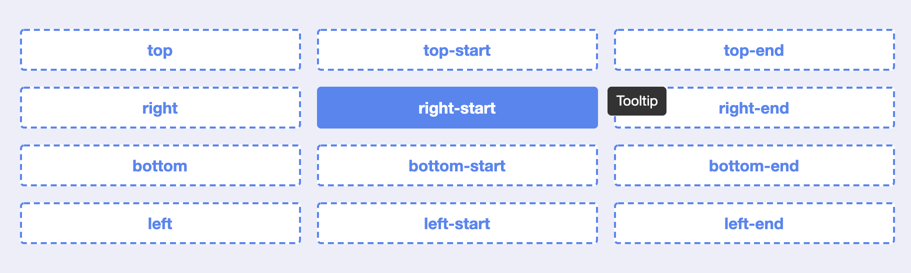

前端爱好者周刊 (Github: shfshanyue/weekly)，每周记录关于前端的开源工具、优秀文章、重大库版本发布记录等等，周刊中优秀文章会在公众号**全栈成长之路**逐一推送。每周一发布，订阅平台如下，欢迎订阅。

- 订阅网站: <https://weekly.shanyue.tech>
- 订阅Github: [shfshanyue/weekly](https://github.com/shfshanyue/weekly)
- [点击在微信订阅](https://mp.weixin.qq.com/mp/appmsgalbum?action=getalbum&__biz=MjM5NjU5NjQ0NQ==&scene=1&album_id=1880625492081344514&count=3#wechat_redirect)

## 封面


包含了从初级到高级有关 React 生态的学习路线图，图片出自 [roadmap.sh](https://roadmap.sh/react)

- 在 Chrome 中打开开发者总局，<Ctrl+Shift+P> 搜索 Full Size，可**截屏网页滚动长页面**
- Deno & Node.js 作者 Ryan Dahl 和联合创始人 Bert Belder 宣布成立了 Deno 公司
- vue3 将不再支持 IE11，原定投入 Vue 3 IE11 支持的精力将投入给 2.7，详情见 [The cost of supporting IE11 in Vue 3](https://github.com/vuejs/rfcs/blob/ie11/active-rfcs/0000-vue3-ie11-support.md)
- 最新数据显示，截至2021年2月底，我国公募基金管理规模达到21.78万亿元

## 文章推荐

### 一、 [图片加载异常兜底方案](https://juejin.cn/post/6945040754255331336)

当图片加载失败后，我们可以使用 DataURI 作为一个友好的兜底方案。但是仍有许多复杂的情况，可以看这篇文章了解一下。

## 开源与库

### 一、 [tippy: 最好用的 tooltip 工具](https://atomiks.github.io/tippyjs/)



一个非常流行的 tooltip 工具，可在 React 中使用，支持多达几十种丰富的选项。

- [repo: atomiks/tippyjs/](https://github.com/atomiks/tippyjs/)
- [npm: tippy.js](https://npm.devtool.tech/tippy.js)

## 开发利器

### 一、 [Svg Viewer](https://www.svgviewer.dev/)


可视化 SVG，并支持压缩图片、转化为 React/RN 组件、转化为 png 格式的图片等

### 二、 [URL-encoder for SVG](https://yoksel.github.io/url-encoder/)


把 SVG 转化为 DataURI，并嵌入到 CSS 样式中

## 代码片段

### 一、 如何把一个数组随机打乱?

使用原生实现，Math.rondom() - 0.5 有时大于0，有时小于0会达成这样的效果

```js
[1, 2, 3, 4].sort((x, y) => Math.random() - 0.5);
```

借用 `lodash` 可更方便

```js
_.shuffle([1, 2, 3, 4]);
//->
```

## 版本发布

### 一、 [Next.js 10.1](https://nextjs.org/blog/next-10-1)

We are excited to introduce Next.js 10.1, featuring:

- 3x Faster Refresh: 200ms faster refresh with no changes necessary.
- Improved Installation Time: 58% smaller install size and 56% fewer dependencies.
- next/image Improvements: Apple Silicon (M1) Support, plus more layout and loader options.
- Next.js Commerce Shopify Integration: Flexible data layer for composable e-commerce apps.
- Custom 500 Page: Add your own logo and branding to error pages.
- Strict PostCSS Configuration Loading: Improved caching with Webpack 5.
- Support for extends in tsconfig.json: Extensible configuration for large TypeScript apps.
- Detect When Preview Mode Is Enabled: Conditionally show content when viewing previews.
- Router Methods Scroll to Top: Automatically scroll to the top, now consistent for all routing.
- Documentation Improvements: Incremental adoption, migration, and Docker deployment.

### 二、 [Node v15.13.0](https://nodejs.org/en/blog/release/v15.13.0/)

在 Node 中也支持了 btoa 与 atob 了

- buffer:
  - implement btoa and atob (James M Snell) #37529
- deps:
  - upgrade npm to 7.7.6 (Ruy Adorno) #37968
    - This update adds workspaces support to npm run and npm exec
- doc:
  - add legacy status to stability index (James M Snell) #37784
  - add @linkgoron to collaborators (Nitzan Uziely) #37817
- http:
  - add http.ClientRequest.getRawHeaderNames() (simov) #37660

### 三、 [npm v7.8.0](https://github.com/npm/cli/releases/tag/v7.8.0)

主要集中在对 workspaces 支持的增强

**FEATURES**

- 8bcc5d73f #2972 feat(workspaces): add repo and docs (@wraithgar)
- ec520ce32 #2998 feat(set-script): implement workspaces
- 32717a60e #3001 feat(view): add workspace support (@wraithgar)
- 7b177e43f #3014 feat(config): add 'envExport' flag (@isaacs)

**BUG FIXES**

- 4c4252348 #3016 fix(usage): specify the key each time for multiples (@isaacs)
- 9237d375b #3013 fix(docs): add workspaces configuration (@wraithgar)
- cb6eb0d20 #3015 fix(ERESOLVE): better errors when current is missing (@isaacs)
