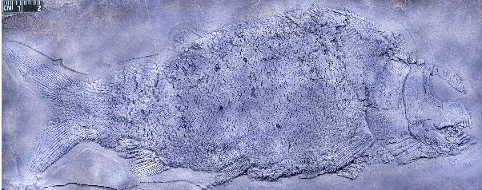
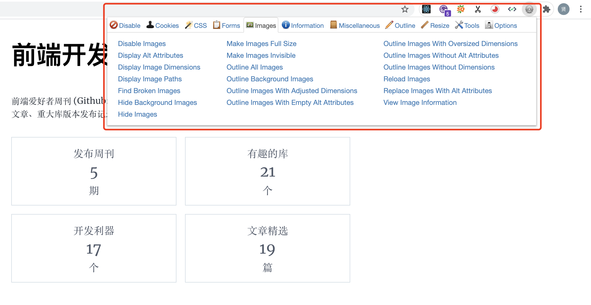

前端爱好者周刊 (Github: shfshanyue/weekly)，每周记录关于前端的开源工具、优秀文章、重大库版本发布记录等等，周刊中优秀文章会在公众号**全栈成长之路**逐一推送。每周一发布，订阅平台如下，欢迎订阅。

- 订阅网站: <https://weekly.shanyue.tech>
- 订阅 Github: [shfshanyue/weekly](https://github.com/shfshanyue/weekly)
- [点击在微信订阅](https://mp.weixin.qq.com/mp/appmsgalbum?__biz=MzA3MzU0MjIzMA==&action=getalbum&album_id=1761820812803620868&scene=21#wechat_redirect)

## 封面



贵州盘州发现 2.44 亿年前一种大型肉食性基干新鳍鱼类的化石，命名为盘州暴鱼

- 在 VSCode 中，通过快捷键 <Ctrl + K + Z> 可快速进入禅模式 (View: Toggle Zen Mode)
- 市场监管总局依法对阿里巴巴的“二选一”垄断行为作出行政处罚，处以其 2019 年中国境内销售额 4557.12 亿元 4%的罚款，计 182.28 亿元
- 贵州盘州发现 2.44 亿年前一种大型肉食性基干新鳍鱼类的化石，命名为盘州暴鱼
- 截至 2021 年 3 月末，我国外汇储备规模为 31700 亿美元，较 2 月末下降 350 亿美元，降幅为 1.09%

## 开发利器

### **一、 [Emmet: Web 开发者的利器](https://emmet.io/)**


高效的前端开发利器，可在 Vue/React 中快速书写修改 HTML/CSS，并支持多种编辑器，如流行的 VSCode。

它最大的功能就是把 `CSS 样式的缩写` 转化为 HTML，如输入 `#page>(#header>ul#nav>li*4>a)+(#content>h1{Hello world}+p)+#footer`，并按下 Tab 键，自动生成以下 HTML

```html
<div id="page">
  <div id="header">
    <ul id="nav">
      <li><a href=""></a></li>
      <li><a href=""></a></li>
      <li><a href=""></a></li>
      <li><a href=""></a></li>
    </ul>
  </div>
  <div id="content">
    <h1>Hello world</h1>
    <p></p>
  </div>
  <div id="footer"></div>
</div>
```

以上扩展缩写的功能被称为 `Expand Abbreviation`。除此之外，它还有更多细致的功能，这些功能在 Emmet 中被称为 `Action`

1. 去除最外层标签
1. 包裹选中的标签
1. ...

- [repo: emmetio/emmet](https://github.com/emmetio/emmet)
- [npm: emmet](https://npm.devtool.tech/emmet)

### **二、 [Web Developer 浏览器插件](https://chrispederick.com/work/web-developer/)**



一款服务于 Web 开发者的浏览器插件，可以针对该网站做更深入的操作，如

1. 禁止 Javascript
1. 禁止 CSS
1. 显示页面所有图片
1. ...

## 文章推荐

### **一、 [纯 Javascript 代码片段大全](https://www.smashingmagazine.com/2021/04/vanilla-javascript-code-snippets/)**


这篇文章总结了几个收集关于 vanilla javascript 代码片段的网站，非常好用，包含以下几个网站

1. [30 Seconds Of Code](https://www.30secondsofcode.org/)
1. [How to manage HTML DOM with vanilla JavaScript only?](https://htmldom.dev/)
1. [Cheat sheet for moving from jQuery to vanilla JavaScript](https://tobiasahlin.com/blog/move-from-jquery-to-vanilla-javascript/)
1. [microjs](http://microjs.com/#)
1. [Single line of code](https://1loc.dev/)

### **二、 [Dark mode in 5 minutes, with inverted lightness variables](https://lea.verou.me/2021/03/inverted-lightness-variables/)**

本文使用 HSL 函数与 CSS 变量自动生成网站暗黑模式

```css
:root {
  --primary-hs: 250 30%;
}

h1 {
  color: hsl(var(--primary-hs) 30%);
}

article {
  background: hsl(var(--primary-hs) 90%);
}

article h2 {
  background: hsl(var(--primary-hs) 40%);
  color: white;
}

@media (prefers-color-scheme: dark) {
  :root {
    --primary-hs: 320 30%;
  }
}
```

[HSL](https://developer.mozilla.org/en-US/docs/Web/CSS/color_value#hsl_colors) 函数如同 RGB 函数一样，可作为 `color` 的属性值，他接受三个参数：色相(Hue)、饱和度(Saturation)和亮度(Lightness)

- H (hue) 色相，单位是角度， 其中 red=0deg(=360deg), green=120deg, blue=240deg
- S (Saturation) 饱和度，单位是百分比，为 0 时代表全灰
- L (Lightness) 亮度，单位是百分比，100% 是白色，0% 是黑色

## 开源与库

### **一、 [charts.css](https://chartscss.org/)**

数据可视化一般用 Canvas 完成，或者使用 SVG 完成，它竟然还能使用 CSS 完成，听起来是不有点意思？

charts.css 通过 CSS 来进行数据可视化，在 charts.css 中画图，一般通过 table、css variables 与 class 控制图表

```html
<table class="charts-css column" id="my-chart">
  ...
</table>
```

- [repo: ChartsCSS/charts.css](https://github.com/ChartsCSS/charts.css)
- [npm: charts.css](https://npm.devtool.tech/charts.css)

## 代码片段

### **一、 使用可选链操作符替代 lodash.get**

```js
const object = { a: [{ b: { c: 3 } }] };
const result = object?.a?.[0]?.b?.c ?? 1;
console.log(result);
//=> 3
```

## 版本发布

### **一、 [Tailwind CSS v2.1](https://blog.tailwindcss.com/tailwindcss-2-1)**

Tailwind CSS v2.1 在四月六日发布，我们来看看它更新了哪些地方

### JIT engine in core

在 Tailwind CSS 的生产模式中可以通过 [purgecss](https://npm.devtool.tech/purgecss) 去除无用的 CSS 代码，但是在开发环境下依然有很大的代码体积，造成极高时间与极差的开发体验。在接下来的 2.1 版本可以启用 `mode: jit` 特性在开发者环境中开启。

```diff-js
  // tailwind.config.js
  module.exports = {
+   mode: 'jit',
    purge: [
      // ...
    ],
    theme: {
      // ...
    }
    // ...
  }
```

同时支持一些更灵活的写法

```html
<!-- Colors -->
<button class="bg-[#1da1f1]">Share on Twitter</button>

<p class="font-bold !font-medium">
  This will be medium even though bold comes later in the CSS.
</p>

<input class="disabled:opacity-75" />
```

另外也有一些其他特性的更新

- Composable CSS filters API
- New blending mode utilities
- New isolation utilities
